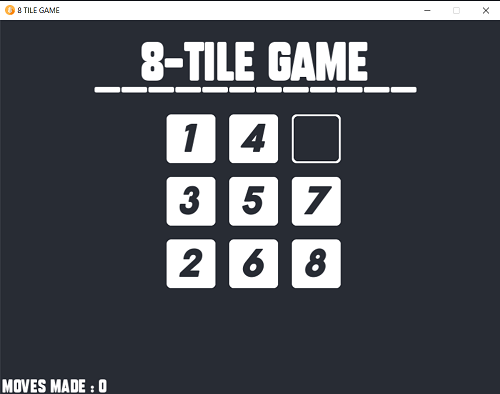

# 8 TILE GAME
The **8 Tile Puzzle** (also called *Gem Puzzle*, *Boss Puzzle*, and many others) is a sliding puzzle having 8 square tiles numbered 1–8 in a frame that is 3 tiles high and 3 tiles wide, leaving one unoccupied tile position. Tiles in the same row or column of the open position can be moved by sliding them horizontally or vertically, respectively. The goal of the puzzle is to place the tiles in numerical order.

The code for the puzzle is implemented in **Python** using the framework *PyGame*


## How to run on Local Machine
-> Download the TILE_8 folder as zip files <br />
-> Install packages like pygame, random, time if not already <br />
  ```
  pip install pygame
  pip install time
  pip install random
  ```
-> Run *main.py* <br />
-> Use arrow key to move, and R key to reset the puzzle

## References
-	Fonts from [DaFont](https://www.dafont.com/)
-	Images made from [Canva](https://www.canva.com/)
